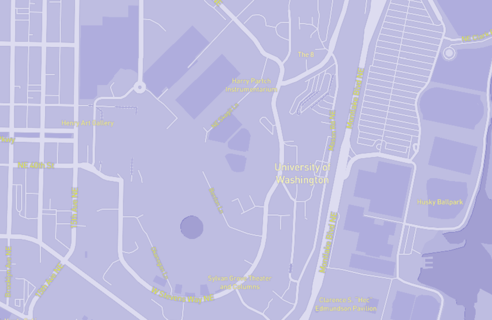

# Tileset Lab

##About the Map
I chose my map extent to be the University District. In order to choose this extent, the zoom level chosen is at 16.
To add style to this map, I made the map color a light purple color and made the labels different shades of yellow.
The reason behind my style and color choices is because purple and gold is UW's school colors.

##Tiles
The tiles used in the map were designed using Mapbox and exported into tile files using QGIS.

###Issues
I had issues originally trying to get the tiles to show at the zoom level I wanted in my html file. I realized that this was due to not setting the max zoom level to a higher number when exporting the tiles.
